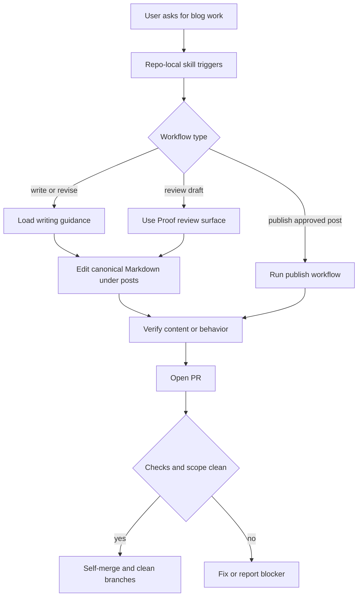

# feat: Add repo-local blog writing publish skill

## Summary

Create a repo-local Codex skill that captures the blog's writing, Proof review, publishing, and PR self-merge workflow for future posts in this repository. The work also reconciles the repo docs and Proof tooling so the skill points at commands and rules that actually exist on `main`.

---

## Problem Frame

The current workflow exists across conversation history, memory, `AGENTS.md`, `docs/writing-guidelines.md`, and a historical branch that contains Proof tooling. That makes future blog work dependent on the current agent remembering the same sequence: draft with the house style, review through Proof after a full draft, sync comments back to local Markdown, publish only after approval, then open and self-merge the PR once checks are clean.

The skill should become the durable entry point for this repo's blog workflow. It should not become a general blogging framework or daily digest automation.

---

## Requirements

- R1. A repo-local skill exists for blog writing, review, and publishing tasks in this repository.
- R2. The skill preserves the established writing style: personal technical essay, concrete examples, source-based full-structure coverage, and no repeated source meta phrasing after the article link.
- R3. The skill keeps `src/content/posts/` as the canonical source and treats Proof as a review surface after a full draft exists.
- R4. The repo exposes a working Proof review launcher that accepts a slug or repo-relative post path and rejects files outside published post content.
- R5. Publishing remains approval-gated until the user says the post can publish.
- R6. After user approval and a clean PR, the workflow lets Codex merge the PR itself, then clean up the remote and fully merged local branch.
- R7. The skill and repo docs stay aligned so future agents do not receive conflicting instructions.
- R8. The work excludes the daily digest/news-screening automation, which should remain a separate workflow if it is later formalized.

---

## Key Technical Decisions

- KTD1. **Use `.codex/skills/blog-writing-publish-workflow/` as the skill home:** The user wants the skill to live in this blog repo, and a project-local path keeps the workflow close to the only directory where it will be used.
- KTD2. **Keep `SKILL.md` concise and move detail into `references/`:** Triggering, core workflow, and routing belong in the entrypoint; detailed writing, review, and publish rules belong in one or more reference files loaded only when needed.
- KTD3. **Restore Proof tooling before depending on it:** Current `main` does not have `scripts/proof-review.mjs` or `proof:review`; the skill must not cite a missing command.
- KTD4. **Treat repo docs as the canonical human-readable contract:** `AGENTS.md` and `docs/writing-guidelines.md` should summarize the norms and point future agents toward the skill rather than duplicating every instruction.
- KTD5. **Keep publish automation bounded by explicit approval and passing checks:** The user's new preference removes manual PR review, not the publish approval or verification gate.

---

## High-Level Technical Design



The skill coordinates the workflow; it should not replace the repo docs or hide execution-time checks. Writing and review always return to local Markdown before verification and publishing.

---

## Output Structure

```text
.codex/skills/blog-writing-publish-workflow/
├── SKILL.md
├── agents/
│   └── openai.yaml
└── references/
    ├── writing-workflow.md
    └── publish-workflow.md
```

This structure is the intended shape. If implementation shows that one reference file is clearer than two, the implementer may collapse the references while keeping `SKILL.md` lean.

---

## Implementation Units

### U1. Scaffold the repo-local skill

- **Goal:** Create the project-local skill folder with valid Codex skill metadata and UI metadata.
- **Requirements:** R1
- **Dependencies:** None
- **Files:** `.codex/skills/blog-writing-publish-workflow/SKILL.md`, `.codex/skills/blog-writing-publish-workflow/agents/openai.yaml`, `.codex/skills/blog-writing-publish-workflow/references/`
- **Approach:** Use the `skill-creator` initialization script so the folder starts from a valid template. Name the skill `blog-writing-publish-workflow` and make the description trigger on blog drafting, source-based reading notes, Proof review, publishing, PR self-merge, and branch cleanup in this repo.
- **Patterns to follow:** System `skill-creator` guidance for frontmatter, interface metadata, and progressive disclosure.
- **Test scenarios:** Test expectation: none -- scaffolding is validated by the skill validator in U5.
- **Verification:** The skill folder has required metadata, contains no placeholder files, and can be discovered as a repo-local skill by a future Codex session.

### U2. Encode writing and review rules in skill references

- **Goal:** Capture the reusable writing and review workflow without bloating the skill entrypoint.
- **Requirements:** R2, R3, R7, R8
- **Dependencies:** U1
- **Files:** `.codex/skills/blog-writing-publish-workflow/SKILL.md`, `.codex/skills/blog-writing-publish-workflow/references/writing-workflow.md`, `.codex/skills/blog-writing-publish-workflow/references/publish-workflow.md`
- **Approach:** Keep `SKILL.md` to the routing rules: consult repo docs, decide whether the task is writing, review, or publish, and load the matching reference. Put source-based full-coverage rules, section-by-section collaboration, Proof timing, canonical Markdown rules, approval gate, self-merge norm, and digest exclusion in references.
- **Patterns to follow:** Existing `docs/writing-guidelines.md` vocabulary; skill progressive-disclosure guidance.
- **Test scenarios:** Test expectation: none -- this is instruction content, validated through review and skill metadata validation.
- **Verification:** A future agent can answer when to draft section-by-section, when to launch Proof, when publishing is allowed, and when the workflow is out of scope without reading conversation history.

### U3. Restore the Proof review launcher and coverage

- **Goal:** Make the documented Proof review entrypoint real on `main`.
- **Requirements:** R3, R4
- **Dependencies:** None
- **Files:** `package.json`, `scripts/proof-review.mjs`, `tests/proof-review.test.ts`, `tests/draft-publication.test.ts`
- **Approach:** Bring forward the historical Proof launcher and test coverage, then reconcile it with current package scripts and content helpers. Preserve the slug/path resolver behavior that prioritizes repo-relative paths with extensions and rejects paths outside `src/content/posts/`.
- **Execution note:** Add or restore tests before relying on the command in skill documentation.
- **Patterns to follow:** Historical branch `draft/claude-code-dynamic-workflows`; existing Vitest test style under `tests/`.
- **Test scenarios:**
  - Passing a post slug resolves to an existing `.md` or `.mdx` post under `src/content/posts/`.
  - Passing a repo-relative Markdown path resolves that exact file instead of treating it as a slug.
  - Passing a path outside `src/content/posts/` fails with a Proof review error.
  - A valid Proof share request derives the document title from frontmatter and returns the Proof URL without writing it to tracked files.
  - Draft posts remain excluded from public listing or routing behavior until `draft` is removed or false.
- **Verification:** The Proof launcher is available through package scripts, resolver tests pass, and draft-publication guard coverage passes with the existing test suite.

### U4. Reconcile repo docs with the skill

- **Goal:** Make `AGENTS.md` and writing guidelines point to the new skill and reflect the current workflow preference.
- **Requirements:** R2, R3, R5, R6, R7, R8
- **Dependencies:** U2, U3
- **Files:** `AGENTS.md`, `docs/writing-guidelines.md`
- **Approach:** Add a short skill pointer and update the draft review and publishing workflow sections. Keep docs concise: they should state durable repo rules, while the skill references carry the step-by-step agent workflow. Record that Codex may self-merge the PR after explicit publish approval, passing checks, and clean PR scope.
- **Patterns to follow:** Existing `AGENTS.md` section style and `docs/writing-guidelines.md` Chinese writing-rule style.
- **Test scenarios:** Test expectation: none -- docs-only alignment, reviewed manually for consistency.
- **Verification:** The docs no longer imply manual PR review is required after a clean publish PR, and they do not contain Proof tokens, session state, or source-specific one-off instructions.

### U5. Validate the skill and repository workflow

- **Goal:** Prove the new skill, Proof tooling, docs, and existing site checks are coherent.
- **Requirements:** R1, R4, R7
- **Dependencies:** U1, U2, U3, U4
- **Files:** `.codex/skills/blog-writing-publish-workflow/SKILL.md`, `.codex/skills/blog-writing-publish-workflow/agents/openai.yaml`, `package.json`, `scripts/proof-review.mjs`, `tests/proof-review.test.ts`, `tests/draft-publication.test.ts`
- **Approach:** Run the skill validator, then run the repo verification appropriate for a package-script and test change. If validation discovers stale interface metadata, regenerate `agents/openai.yaml` from the final skill body.
- **Patterns to follow:** `skill-creator` quick validation; repo verification defaults in `AGENTS.md`.
- **Test scenarios:**
  - Skill validation accepts `SKILL.md` frontmatter and folder naming.
  - UI metadata remains consistent with the skill's actual trigger description.
  - Existing content and routing tests still pass after restoring Proof and draft-publication coverage.
  - Static build completes without exposing `draft: true` posts.
- **Verification:** Skill validation passes; Astro check, Vitest, and static build complete successfully.

---

## Scope Boundaries

### In Scope

- Repo-local Codex skill for this blog workflow.
- Proof review command, tests, and docs needed by that skill.
- Documentation updates for writing style, Proof review, approval-gated publishing, PR self-merge, and branch cleanup.

### Out of Scope

- Daily digest/news-screening automation.
- New article content or revisions to existing posts.
- A custom web editing product beyond the current Proof review surface.
- Direct push publishing to `main`.

### Deferred to Follow-Up Work

- Forward-testing the skill in a fresh Codex thread with a new article request after the initial implementation ships.
- A separate skill or automation for daily OpenAI/Claude article screening if the digest workflow needs the same treatment later.

---

## Risks & Dependencies

- **Repo-local skill discovery may vary by Codex surface:** The implementation should verify the current app discovers `.codex/skills/` from this repository, or document the fallback if discovery is not automatic.
- **Historical Proof code may drift from current dependencies:** The restored launcher should be reconciled against current Node and Vitest versions rather than copied blindly.
- **Self-merge can hide missed scope drift:** The workflow must preserve explicit publish approval, passing checks, and branch cleanup checks before merging.
- **Instruction duplication can diverge:** Keep detailed operational steps in the skill references and only durable norms in repo docs.

---

## Documentation / Operational Notes

- The skill should tell agents to read `docs/writing-guidelines.md` before drafting or revising posts.
- The skill should state that Proof URLs and secrets are session artifacts, not repo artifacts.
- The publish workflow should preserve PR-based publishing while allowing Codex to merge after the agreed gates are satisfied.
- The skill should make its non-goal clear: digest automation is separate from writing, review, and publish.

---

## Sources / Research

- Current `AGENTS.md` defines the blog stack, content model, writing style, publish approval, branch cleanup, and verification defaults.
- Current `docs/writing-guidelines.md` defines the baseline collaboration, article positioning, frontmatter, and publish checks.
- Historical branch `draft/claude-code-dynamic-workflows` contains Proof review script, tests, and expanded writing workflow language that should be reconciled into `main`.
- Memory for this repo records the established source-based full-coverage style, Proof-as-review-surface rule, and verification defaults from prior blog work.
